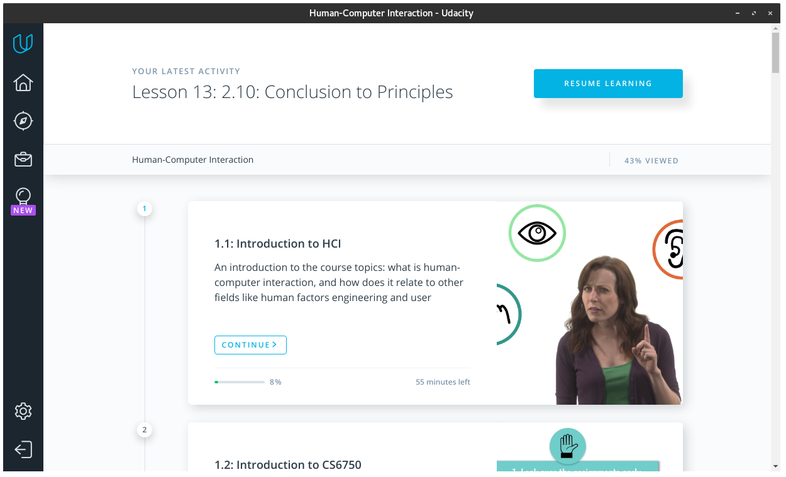

Udacious :v:
============

[Electron](https://electronjs.org/)-powered desktop apps, built with
[nativeifier](https://github.com/jiahaog/nativefier), for the
[Udacity](https://udacity.com) classroom.

> NOTE: This project is not affiliated with, funded, or associated with
> Udacity, Inc.

## Installation

1. Download the latest [release](https://github.com/allanbreyes/udacious/releases) for your operating system
1. Extract the archive
1. Locate and run the executable, e.g. `Udacious.exe`
1. Sign in and get your learn on!

## Building

1. Install [Node.js](https://nodejs.org) and [yarn](https://yarnpkg.com)
1. Run `make`, or specify your operating system, e.g. `make (linux|osx|windows)`

> NOTE: This is not guaranteed to succeed, as it depends on the live website.

## (Un)License

See the [(UN)LICENSE](LICENSE).
